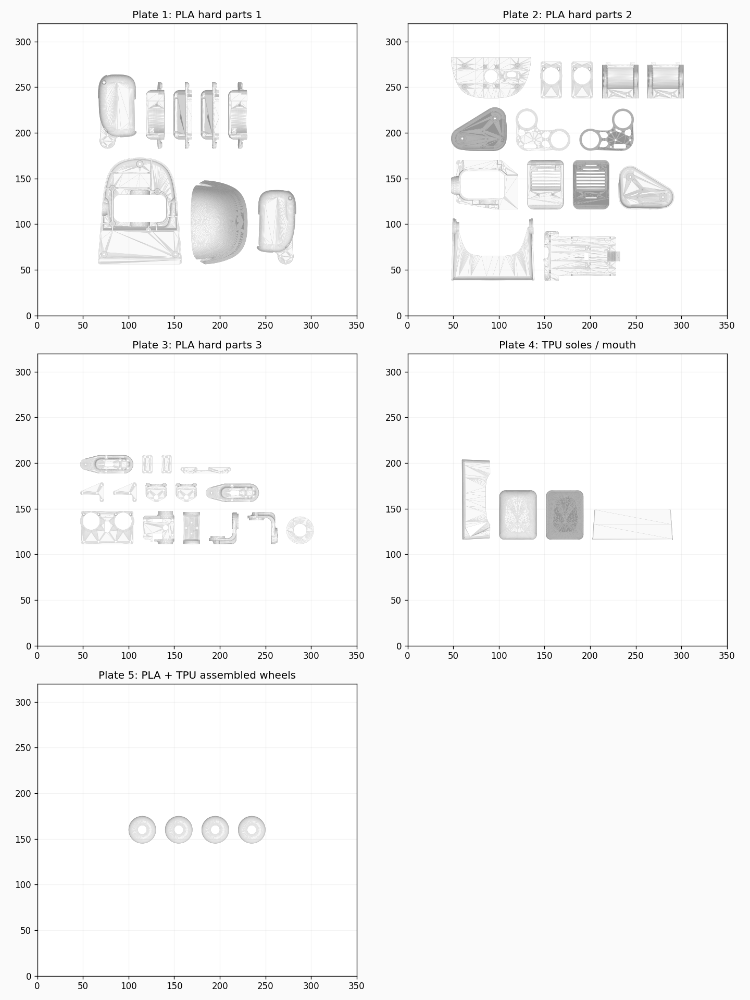
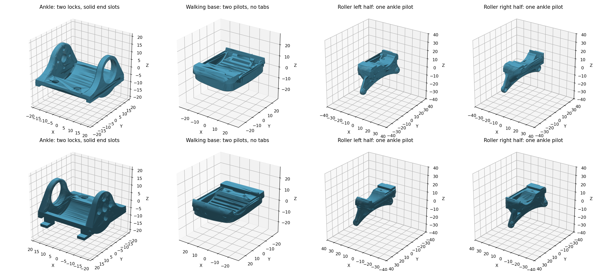
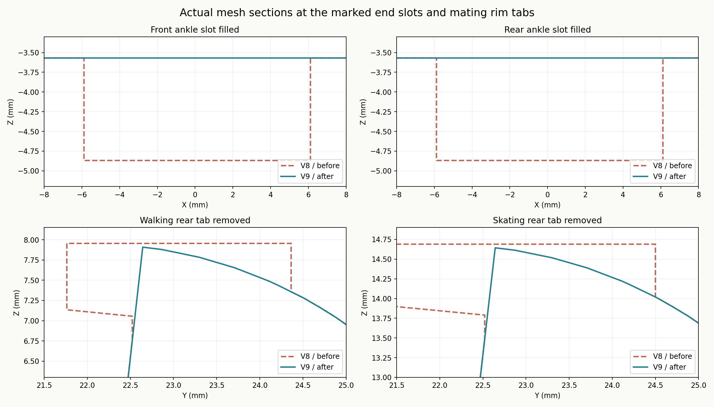
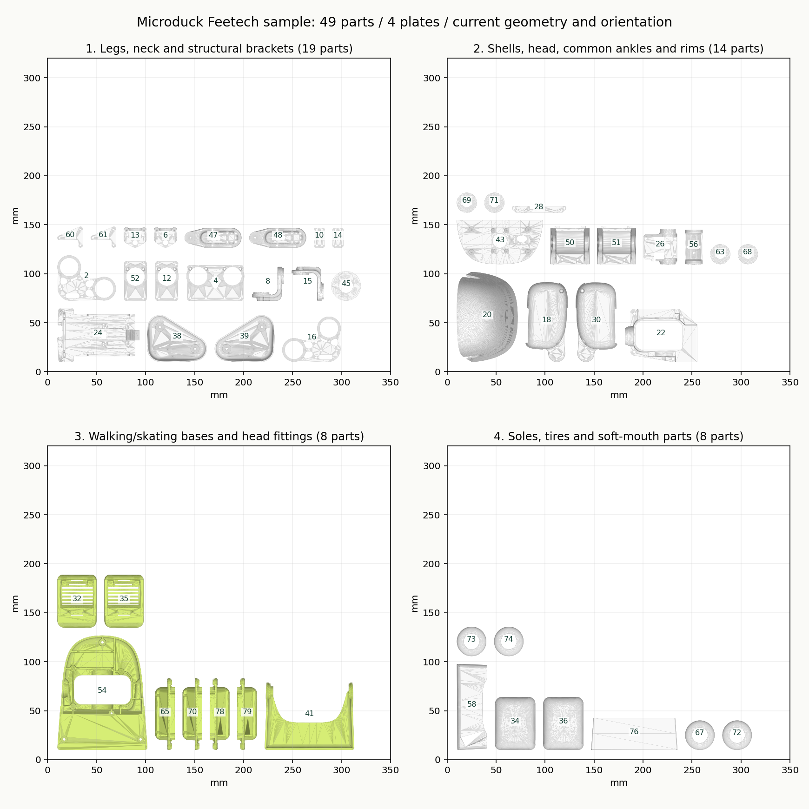

# 飞特打印样例

项目只保留一份制造源文件：[`mircroduck_feetech_revision.3mf`](../models/mircroduck_feetech_revision.3mf)。这份文件采用维护者最新保存的优化版，包括通用脚踝及配套步行／轮滑底座。此前的试验版、对照模型、STL、打印套件和项目内备份已清理；网页展示所用 GLB 仍独立保留。

## 左右脚踝修正（当前 v10）

当前输入是维护者重新保存的 6 盘项目，45 个独立对象、49 个材料部件保持不变。两只脚踝此前引用同一份网格，打印变换也相同，导致轴承座均在同侧。现保留右脚踝 50，将左脚踝 51 沿局部 X 方向镜像，形成左右配对；前后 Y 和上下 Z 不翻转。分别命名为 `ankle_right_dual_locks_v10.stl` 和 `ankle_left_dual_locks_v10.stl`。

左步行底座 35 已有镜像关系，保留原变换。轮滑底座的短钩承接口有左右偏置，单独镜像脚踝会产生约 12.71 mm³ 干涉，因此左轮滑座两半 63、71 同步镜像；右轮滑座 67、72 保留。左右脚踝继续共用各自对应的步行／轮滑接口，保留孔距 16 mm 的双 M2 锁紧孔、后端短钩及从内向外安装的轴承挡肩。

此次改变三件零件的左右手性，并区分两只脚踝的名称。维护者保存的输入把 TPU 槽设为橙色，现按此前全白样例要求恢复白色，PLA／TPU 耗材配置和其他工艺参数不变。所有网格资源、尺寸比例、打印位置、盘成员和其他零件变换均保留当前输入；第 3、6 盘旧预览失效，供切片软件重建。当前源盘对象数依次为 4、10、21、4、4、2；第 6 盘单放左右脚踝。网页导出继续按所选打印机重新居中排盘，源盘布局不等于导出盘布局。以下五盘居中记录属于前一发布阶段。

Bambu Studio 原生读取通过；58 项几何检查验证左右反射关系、两种底座落座无干涉、双孔通道、短钩抗抬起及两侧轴承插入方向，交叠体积容差为 0.0001 mm³。当前 6 盘无新增或既有零件足迹重叠。CAD 快照实际查看了配对脚踝的轴承环和电机安装板位置；短钩在此视角被遮挡，以几何检查为准。尚未切片、打印或实物试装。

当前检查见 [`feetech-handedness-check.json`](feetech-handedness-check.json)，修正与验证脚本分别为 [`correct_feetech_handedness.py`](../scripts/correct_feetech_handedness.py)、[`check_feetech_handedness.py`](../scripts/check_feetech_handedness.py)。脚本要求候选输出并校验测量输入的 SHA-256，不能再次应用到已修正文件。样例绑定已同步维护者重新保存后的对象／材料部件编号。

2026-10-05 双孔修改阶段：在四组 PLA／TPU 双材料轮组的基础上，恢复去除横向长槽／凸筋及两侧对称锁紧孔。两只共用脚踝、两只步行底座和两只轮滑底座（四个半件）均同步修改。这一几何修改阶段保留 49 个材料部件、45 个独立对象及当时的 4 个盘；其后白模型整理见下节。新文件通过 Bambu 原生读取、149 项装配几何检查、八件实际网格的孔道／支承／闭合检查及 CAD 快照检查。未进行切片或实物试装。

“导出 → 导出 3D 打印模型”对话框在上传按钮右侧提供“使用飞特样例模型”。点击后才请求样例文件；上传入口继续处理用户自己的文件。Vite 在构建时从唯一制造源生成带内容哈希的资源 URL，不需手动复制第二份 3MF。

样例的对象 ID、源名称与显示零件 ID 对应关系在 [`feetech-sample.json`](../src/models/feetech-sample.json)，模型适配器在 [`feetech-sample.ts`](../src/models/feetech-sample.ts)。47 件有明确配色关联，包括左右通用脚踝、左右步行脚、四件轮滑座半件及四个轮组内的八个轮辋／轮胎；两块额外薄加固板保持独立配色。同一只轮滑座的两半跟随同一个配色部件，但作为两个制造实例独立导出。加载时先检查完整对应关系，源文件重新编号或改名后必须更新适配器，避免把左右件配色误用。

## 白模型与材料分组（五盘整理阶段）

制造源现为全部白色（#FFFFFF）、不上色，仅保留两个耗材槽：1 为 PLA，2 为 Generic TPU。41 个硬材料部件使用 PLA；8 个软材料部件使用 TPU，包括四个轮胎、左右脚底、软嘴和软下巴。独立 TPU 零件单放第 4 盘；四个 PLA 轮辋／TPU 轮胎组合轮组放第 5 盘。原有机械设计、49 份网格、各件朝向和比例逐字节保留；所有独立对象按材料重新分盘并居中平移。候选文件先通过 Bambu Studio 原生读取，再替换制造源。

网页选择飞特样例时，默认使用源文件的白色 PLA／TPU，不随当前彩色方案改变；需要上色时可手动选择关联部件。普通上传文件的配色匹配行为保持原样。完整白模型配色配置见 [`feetech-white.palette.json`](feetech-white.palette.json)，可在编辑器导入；该配置无后处理涂色。当前材料、居中分盘和网格保留检查见 [`feetech-centered-check.json`](feetech-centered-check.json)，排盘脚本为 [`center_feetech_plates.ts`](../scripts/center_feetech_plates.ts)。白材料转换阶段的历史检查为 [`feetech-white-check.json`](feetech-white-check.json)。



## 双材料轮组

四个轮组各自包含两个独立材料部件：轮辋使用 PLA（源材料槽 1），轮胎使用 Generic TPU（白模型源材料槽 2，组合阶段原为槽 8）。直径 30 mm、宽约 7.6 mm，保留原网格、轴承孔和机械咬合轮廓；只改变装配与分盘关系。四个组合轮组同轴贴床；组合阶段原为第 4 盘和 8 mm 间距，当前居中版改为第 5 盘和 10 mm 间距。组合阶段其余零件的网格、摆放和材料保持输入文件的状态；当前白模型的软材料分类及居中分盘见上节。

网页导入保留部件各自的颜色／材料和相对位置；重新分盘以完整组合件为单位，3MF 导出仍是含两个材料部件的同一个对象。单独 STL 不携带装配或材料关系，请使用 3MF 打印组合轮组。组合件只能整体启用或排除，避免遗漏其中一种材料。网页配色仍按各轮辋／轮胎的独立配色部件处理。

轮组组合阶段的检查记录见 [`feetech-wheels-check.json`](feetech-wheels-check.json)；锁紧几何阶段检查见 [`feetech-mount-v9-check.json`](feetech-mount-v9-check.json)。脚本 [`combine_feetech_wheels.py`](../scripts/combine_feetech_wheels.py) 需要显式输入、候选输出、预期源 SHA-256 及 Bambu 官方耗材配置目录，不原地覆盖源文件。实际双材料切片、打印及材料结合效果尚未验证。

## 双孔锁紧及去筋条（v9 基础几何）

两只脚踝的 10×15×3 mm 轴承均从内侧向外安装：Ø15.2 mm 座深 3 mm，外侧保留 Ø14.5 mm 挡肩。轴线和后端两个短横钩保留。

原来的居中竖向锁紧孔已填实，改成两侧对称的两颗 M2 螺丝，孔距 16 mm；两只脚踝、两只步行底座和两只轮滑底座同步修改。轮滑座左右半件各承接一颗竖向锁紧螺丝，螺丝不跨中缝。脚踝沿用 Ø2.2 mm 通孔及 Ø4.4 mm 螺丝头沉孔，底座沿用 Ø1.6 mm 底孔，新增 Ø5.2 mm 外径支承柱以保证步行底座内部的锁紧深度。竖向锁紧螺丝沿用现有规格，长度须在实物试装时核对。

维护者图中标出的两条长槽位于脚踝前后沿，横跨 X 方向，每条约 12×1.4×1.3 mm；已完整填实。步行和轮滑底座的对应凸筋已按相邻圆角轮廓削除，并为填实处留出原有 0.15 mm 装配间隙。v8 只处理了纵向下方台阶，未覆盖这两处横向长槽；此处以 v9 的实际网格和检查报告为准。

每只轮滑底座仍沿纵向中心线拆成左右两半，接合间隙 0.2 mm，前后各一颗横向 M2 螺丝。沿用 Ø2.2 mm 过孔、Ø1.6 mm 自攻底孔、Ø4.4 mm 螺丝头与工具通道。头座距中缝约 3.2 mm，另一半底孔深约 5.2 mm，可从 M2×8 开始试装；最终长度须根据实际螺丝头和打印件确认。通道沿 X 方向从外侧连通到头座。每只轮滑座装配共用两颗竖向锁紧螺丝及两颗横向合拢螺丝。

现为 **49 个材料部件、45 个独立对象**，本次修改四个共享网格（对应八件脚踝／底座零件），其余网格逐字节不变。149 项几何检查覆盖长槽填实、凸筋完整取消、旧中心孔填实、短钩保留及抗抬起、脚踝落座、两侧沉孔与底孔连通、底孔支承壁、轮胎／轮辋避让、左右半件拆装路径、横向螺丝通道和原轮轴位置。轴承安装区的几何与 v8 保持一致。核验见 [`feetech-mount-v9-check.json`](feetech-mount-v9-check.json)，生成脚本为 [`revise_feetech_locks.py`](../scripts/revise_feetech_locks.py)。脚本要求明确输入、输出路径，并校验测量基线 SHA-256，支持旧版单独轮胎／轮毂和本次的双材料轮组基线，不能重复应用到已修改的 v9。双材料轮组基线中的左右轮滑半件分别居中，脚本先对齐共同装配坐标，再将修改结果还原到各自的原始局部坐标。





## 原模型分盘

保留源 H2D 的 350 × 320 mm 底板、工艺和每件打印旋转／镜像／比例；当前耗材已统一为白色 PLA／TPU；新增半件沿用原轮滑座朝向。历史分盘这一步只平移贴床，不再修改当时的网格；当前轮组分盘变动见上节。源与网页均按可达区域居中排盘。H2D 共同可达区域为 X=25–325 mm，再留 20 mm 边距，实际排盘区域 X=45–305、Y=20–300 mm；零件足迹间距至少 10 mm。每盘整体足迹中心为 (175,160) mm，旋转、镜像和比例保持原样。49 个材料部件全部保留，旧盘预览已清除以便切片软件重建。下表为当前 45 个独立对象的盘分布。

| 盘  | 用途                   | 独立对象数 |
| --- | ---------------------- | ---------: |
| 1   | 白色 PLA 硬质零件      |          8 |
| 2   | 白色 PLA 硬质零件      |         14 |
| 3   | 白色 PLA 硬质零件      |         15 |
| 4   | 白色 TPU 脚底与软嘴    |          4 |
| 5   | 白色 PLA／TPU 组合轮组 |          4 |

当前输入经过 Bambu 重新保存，采用三列源盘坐标。已按实际零件 ID／名称更新样例对应关系，重建盘成员及盘名，避免旧盘坐标与新盘标题错位。网页默认边距 20 mm、间距 10 mm，重新下载时同样居中，依打印机可达区域排盘。

旧版独立轮胎／轮毂的分盘记录：



网页下载时会按所选打印机及实际打印配置重新分盘；样例默认全白 PLA／TPU，可手动关联当前配色。源文件的五盘是打开原模型时的整理方式。源 License/Copyright 进入下载的 3MF 及 `MODEL-LICENSE.txt`，模型继续遵循 Pollen Robotics 署名及 CC BY-NC-SA 4.0。

核验数据见 [`feetech-sample-check.json`](feetech-sample-check.json)。45 件为封闭网格；源文件的两只上腿装饰和两只腿部件为非封闭网格，未作自动修复。分盘后再次检查实际序列化的世界坐标，网格闭合状态、朝向和尺寸均保留。尚未切片、实物试装或启动打印。

以下为历史单部件分盘脚本的用法，当前双材料组合版由轮组脚本整理，不能再使用此单部件脚本。该脚本只修改明确指定的文件，会在系统临时目录保留修改前备份。需要 Python 的 numpy、trimesh、matplotlib：

```sh
python scripts/arrange_feetech_sample.py \
  --source models/mircroduck_feetech_revision.3mf \
  --report docs/feetech-sample-check.json \
  --preview docs/media/feetech-sample-plates.png
```
